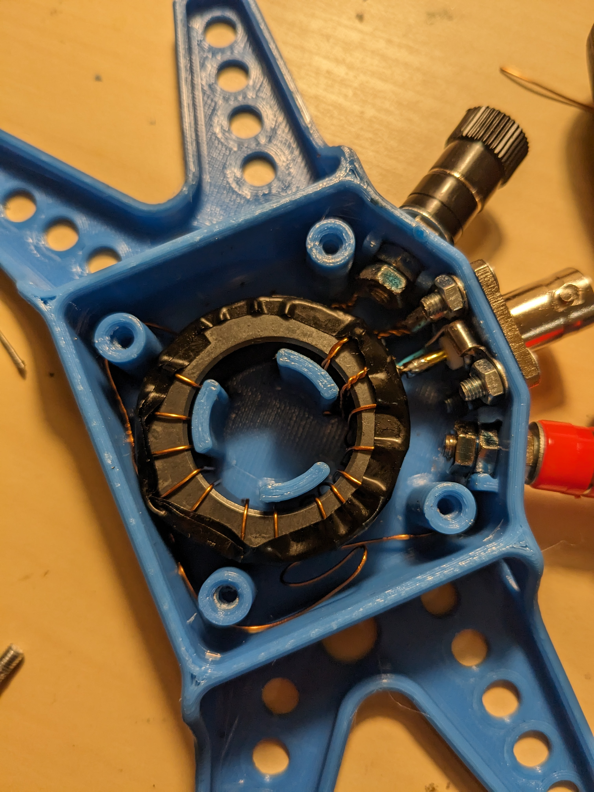
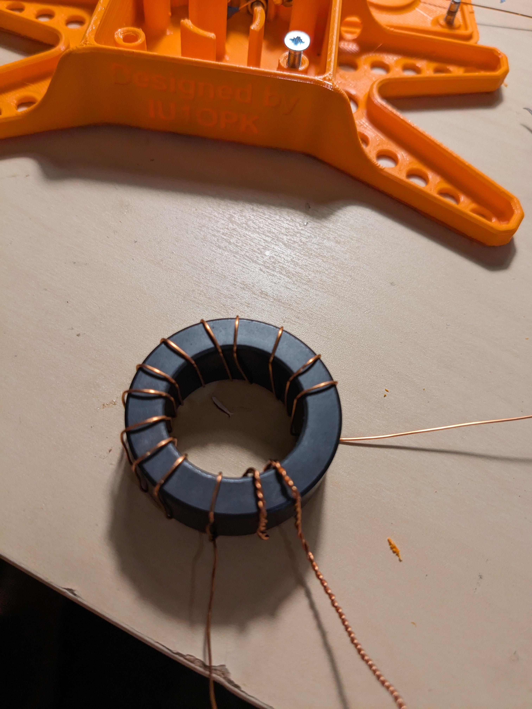
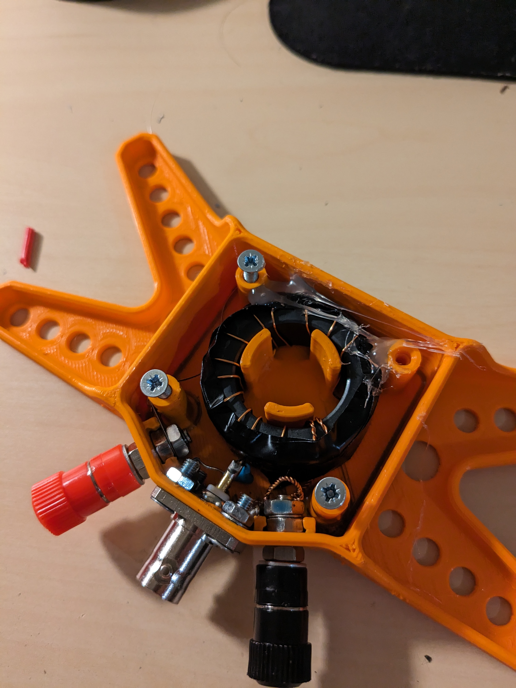
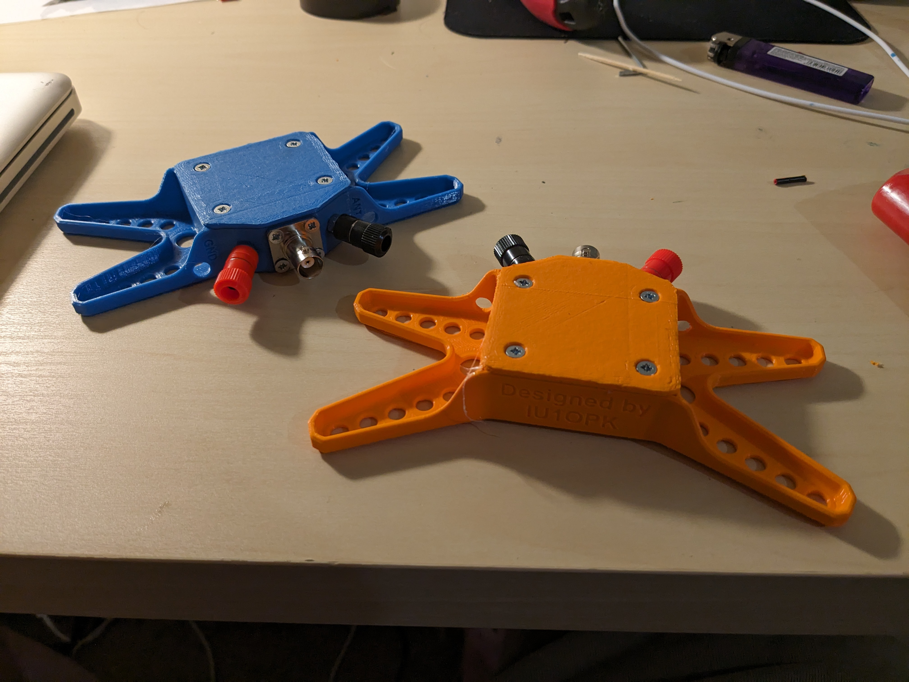
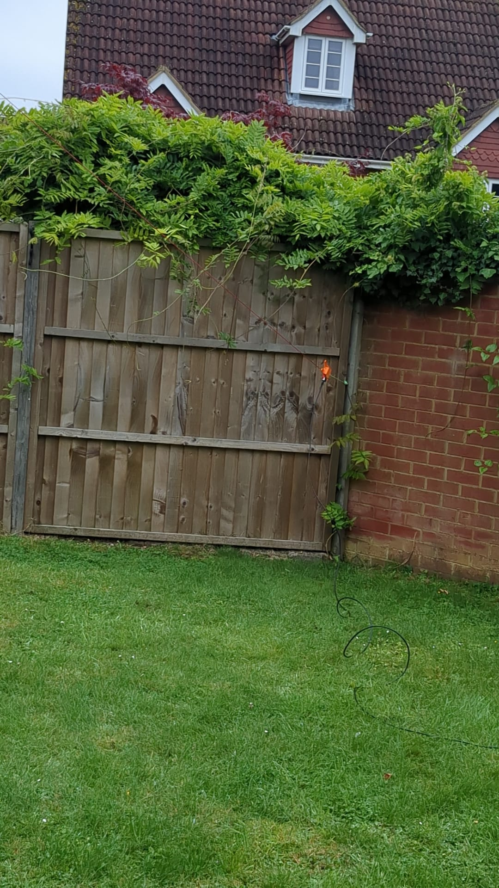

<!-- Each page should have a link to the previous page and (if applicable)the next page. -->

[Previous (Home)](../../README.md)

# 49 to 1 EFHW Transformers

Simple 49:1 EFHW Transformer build using a FT140-43 toroid

Made some efhw transformers over the weekend.Case 3D Printed at Basingstoke Makerspace. Designed by IU1OPK

## What is EFHW (lazy crapgpt copy)

An end-fed half-wave (EFHW) antenna is a favored choice among ham radio enthusiasts due to its simplicity and versatility. It's referred to as "end-fed" because it's fed with a single wire at one end, in contrast to traditional center-fed dipole antennas. This design makes EFHW antennas ideal for portable operations and restricted space installations. Here's a detailed overview of what an EFHW antenna is, its uses, and how it works:

Design Basics: An EFHW antenna is essentially a half-wavelength wire that's typically resonant on one or more ham radio bands. The length of the wire is determined by the desired frequency of operation, making it a resonant antenna.

Single-Ended Feeding: Unlike center-fed antennas, which require a balun or a center insulator, an EFHW antenna is fed directly at one end. This simplicity reduces the need for additional components and simplifies deployment.

Wire Length: The length of the wire is a key factor in EFHW design. For optimal performance, the wire should be approximately half the wavelength of the desired frequency. For instance, for the 40-meter band (around 7 MHz), the ideal length is roughly 20 meters.

Impedance Matching: EFHW antennas often have a high impedance at the feed point, typically around 2,000-3,000 ohms. To match this to the ham radio transceiver's lower 50-ohm impedance, a matching network such as an L-network tuner or a 9:1 unun transformer is used.

Deployment Options: EFHW antennas can be deployed in various configurations, such as sloping, vertical, or as an inverted L. This adaptability allows hams to use them in restricted spaces or when portable, making them ideal for field operations, parks, or summits.

Multi-Band Operation: EFHW antennas can be designed to work on multiple bands by incorporating additional resonant elements or using an antenna tuner capable of handling a wide impedance range. This versatility makes them great for covering several ham bands with a single antenna.

## Does it work

## Some Photos

