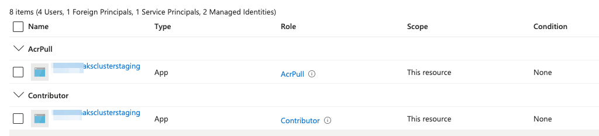

# Tips and Tricks for AKS on Azure

In this quick writeup, I would like to share my findings and recommendations regarding AKS deployments on Azure. From resizing the main node pool and adjusting maximum pods per agent to managing load balancer SKUs and network policies, these tips will assist you in making informed decisions for your AKS clusters. Obviously these are personal findings and will never cover the whole AKS and every use case, but it could be a nice start. Started working with AKS, these are my findings 6 months in...

## Findings
### Resizing the Main Node Pool
The main node pool in AKS can be resized, but the instance type cannot be easily changed. It's recommended to start with a decent size VM that can accommodate your generic services like NGINX-Ingress controller, Redis Servers, and Databases. When you require more compute, you can add additional node pools.

### Adjusting Maximum Pods per Agent
The maximum number of pods that can run on each agent in AKS is specified by the max_pods parameter in Terraform. Unfortunately, this parameter cannot be updated without recreating the entire AKS cluster. If you are unsure about the required capacity, it's advisable to expand it to a higher value during cluster creation. The default value depends on the network plugin being used.

### Load Balancer SKU
The SKU of the Load Balancer used for the Kubernetes cluster cannot be changed after cluster creation. For development environments or low network traffic scenarios, you can set the SKU to basic. The default SKU is standard.

### Network Policies and IP Addresses
Network policies in AKS cannot be edited without recreating the entire cluster. If you are using the "azure" network plugin, ensure that you have enough IP addresses in the subnet assigned to AKS.

### Public Access to the Cluster
Public access to the AKS cluster cannot be changed after creation. By default, it is set to true.

### Avoid Overlapping CIDR
Ensure that your service_cidr does not overlap with any element of your Virtual Network (VNET). It's best to choose a CIDR range that is as far away as possible from other network elements.

### Integrating AKS with ACR
To integrate AKS with Azure Container Registry (ACR), you need to grant AKS the AcrPull permission in the IAM section of your subscription.

### Granting Permissions for Resource Creation
For AKS to create its own Azure resources such as persistent volumes using Storage Accounts and Load Balancers, the AKS cluster must be granted the Contributor role in the IAM section of your subscription.
 
Photo showing AKS roles in the IAM Section of the Azure Subscription
 
.

### Enabling Blob Containers for Persistent Volumes
If you plan to use Storage Account's Blob Containers for persistent volumes, you must explicitly enable the blob.csi controller.

## Wrap Up
And that's a wrap on these AKS tips and tricks! I hope you found them helpful and gained some new insights for your AKS endeavors. Keep in mind that technology is ever-evolving, and AKS is no exception. So, while these findings hold true for now, it's always a good idea to stay up to date with the latest updates and improvements in the AKS ecosystem.