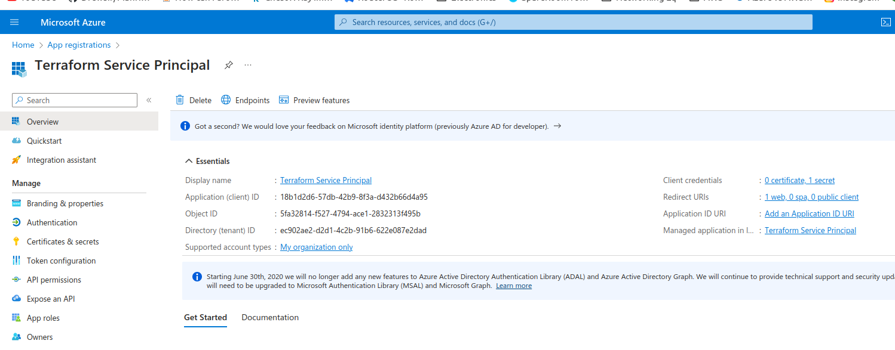
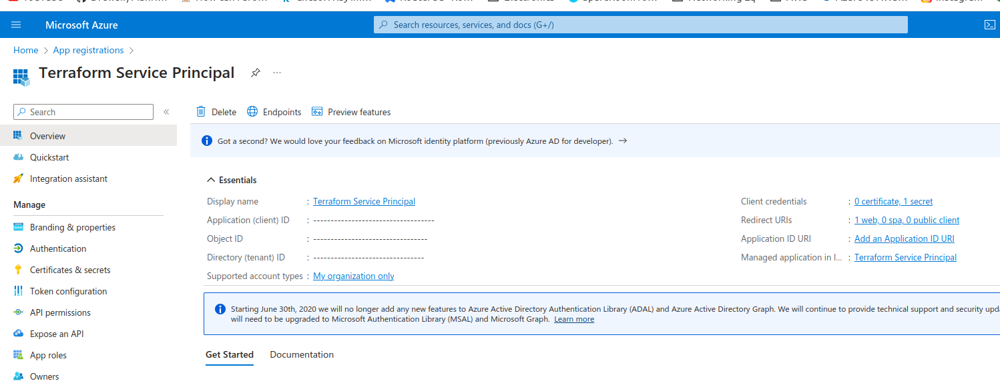
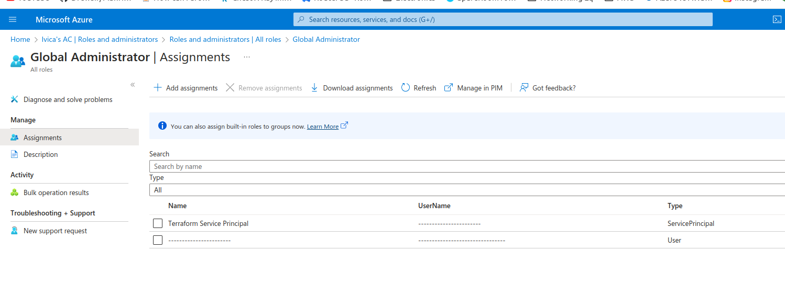

<!-- Each page should have a link to the previous page and (if applicable)the next page. -->

[Previous (Home)](../../README.md)

# Terraform Template for Azure

GitHub repository in a form of a template for creating a new Terraform project for interfacing with the Azure cloud.

Working with cloud infrastructure programmatically can seem like a daunting task for many, but in todays world filled with various tools and frameworks, it does not really have to be. Terraform is one of the most popular tools for managing cloud infrastructure as code. It is a declarative language that allows you to define your infrastructure in a simple and easy to understand way.

On the end of day, we are storing our code on the GitHub, we build it using Actions, so why wouldnt we do the same for our infrastructure? This repo is a simple template project used to initialize a new Terraform project on Github, with GitHub actions for interfacing with the Azure cloud.

The github repository is available at: https://github.com/ivica3730k/azure-terraform-template

Below is readme from the repo:

## azure-terraform-template

This repo is a simple template project used to initialize a new Terraform project for interfacing with the Azure cloud.

Minimal setup includes storing a remote state in the Azure cloud and using a service principal to authenticate with Azure. The service principal has appropriate access to the subscription and the Active Directory tenant.

In addition to the above, this template also includes a GitHub Actions workflow that will automatically run a `terraform plan` command on every pull request. This allows for a quick sanity check on the changes being made before they are merged into the main branch. The plan output is stored as an artifact on the pull request and can be downloaded for further inspection. Once the pull request is merged, another GitHub Actions workflow will run a `terraform apply` command to apply the changes to the infrastructure. Just like for the plan, the apply output is stored as an artifact, and in case of failure, a GitHub issue is opened with the apply output attached.

### Prerequisites

- Azure subscription
- Azure Service Principal with appropriate access to the subscription and the Active Directory tenant
- Azure storage account for storing the remote state

### Service Principal Setup

1. Create a service principal in the Azure Dashboard and create a client secret for it. Make sure to save the secret as it will not be shown again.
   

2. Assign the service principal to the subscription
   

3. Assign the service principal to the Active Directory tenant
   

### Local development

It is possible to run Terraform actions locally from your machine without pushing to GitHub and/or making pull requests. This is useful for testing and debugging. To do so, you need to have Terraform installed on your machine.

Once that is done, you need to set some environment variables. The easiest way to do this is to create a `.env` file in the root of the project and set the variables there. The `.env` file is ignored by git, so it will not be pushed to GitHub. The `.env` file should look something like this:

```plaintext
TF_VAR_SUBSCRIPTION_ID=---------------
TF_VAR_TENANT_ID=---------------
TF_VAR_CLIENT_ID=------------------
TF_VAR_CLIENT_SECRET=---------------------------
TF_VAR_STATE_RESOURCE_GROUP_NAME=terraform-states
TF_VAR_STATE_STORAGE_ACCOUNT_NAME=icecloudtfstates
TF_VAR_STATE_CONTAINER_NAME=terraform-state-icecloud-prod
TF_VAR_ENVIRONMENT=prod

```

For the convinience, the project includes a `local_setup.sh` file which reads the contents of the .env file into environment and initializes your terraform project locally. You can run it by executing `./local_setup.sh` in the root of the project.

This now allows you to run terraform commands locally.


### Notes

1. This is using last version of Terraform before their license change.
2. You still need to make your state storage account, container and resource group manually.
3. AzureRM and AzureAD providers are pinned to a specific version. Feel free to update them if you wish so.
4. As always in this day and age, parts of this writeup were made and spell-checked by ChatGPT :P
