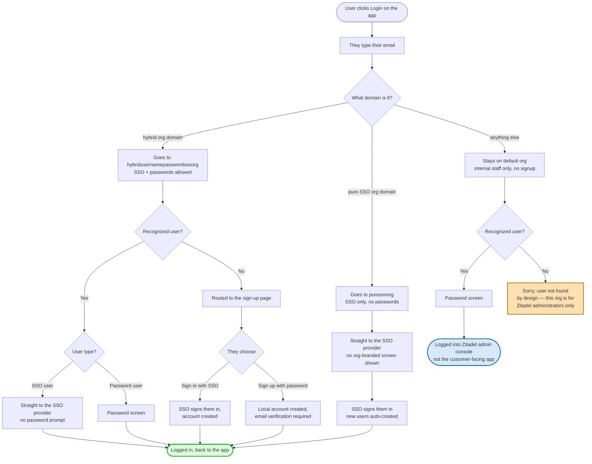

# Why we can't have "SSO-first with admin-managed password accounts on Zitadel"

> What we wanted: take users straight to their company SSO (Identity Provider, or IDP). New employees just sign in and the account is created automatically (just-in-time provisioning, JIT). As an admin escape hatch, we can also create individual username/password accounts in the Zitadel UI (admin-provisioned local credentials) for service accounts, contractors without an SSO identity, or break-glass logins.
>
> **Zitadel doesn't let us build it.** The rest of this doc explains why.

## What users actually experience today

[Open this chart in mermaid.live →](https://mermaid.live/edit#pako:eNqNVeFu2zYQfpUDiwIdZme247i2MHQYaiADVrRBnWFYbf-gpZNERCY1kqrrOgH2EHvCPcmOpCTLXh0sPxKKd_fdfd8dLwcWqwRZxNJC7eKcawv385UE-llY-nq1_M2ghrgQ8YOBdyoTEpQEmyPwslx_B_3-G7jfl7i8z3EPlk7OKDTglotiHaCcg_ecCxMffs-5hUSRXYIwIOxPTysZHJ3dOT7m-40WCSid1Z6P8Iu_Wt4qNGAVBI-KqpN8iyU3Zqd0YoyimB83-oc3i8UH-B5aA_CCKGKyPstUVhrB-XZz3dFlm8l5nOEqWex7INUR_hyWy73NhcwAC4OPMMd0SYLujVMvwZRXhYUGUUjrWBRgLE_TI7gRmazKdSPOy5cOpomEf_76Gz4JyxMsgCdbIU0baV1zwGlj6rIwDfpj-qtUO3n4iLHKpPiKiXdzHaj9vN1T-AONL_xut7yraYKJNaJcf8P7vfLOc-TJcqG0pkIcsq8mVZVMPNXNntg7Xr58Ush4LvQnVdp7nFASxmpulQ7UukocmxJB08JgdL3zZN3hVpHsmosst66Vbm5d_0qtPosEQ0ZSmmD6G81lgg1FMDkxWx8hb1ULOlcSlw7GETEOdAtCBizcBd2BV1b1CYpbP3Nt4c_NbVRbg3MYeJ81HJ9tXcfl2L1w6Z6we4IH_5bdG70U5JoY7t7jbvlRVVR8o5sj269KGvkMW0KnCTyGE8YV1iDR9__qQSOFM2xLu76YoB3GbpaLQ9rS6Qj5NlcixoNfWXGulMETPYI5kHGjSntqJ2zuqu7I43mdD0HPs-FxTBNv4dj-y-CkqAdv6HcyvFMxL5b-N5xBhjx-x8Jn1CIVMbeCdovGPyuhOyO3qOKYXsorwsky6ibVCBsePzSt8Gv8OOZutr1SdVy3dMf2gulud8kSlHrGGvid2IPHz24D_Ld8qvtkR0CspFEF1nNkPau4MlZtUfdTHrst3GHpN5rP103QJDV2X2CzyCAVRRG9SFMcbK57tIvUA0Yv-GRQn_s7kdg8GpVfusE1Yh2cpEkbOeDPR3YLasInOEvTI8KEfwOB9VhGYrLI6gp7jHjTYNAnOzj0FXPDiSsW0THh-mHFVvKJYkouPym1bcK0qrKcRSmn_1g9VpUJDdpc8EzzbXurkXakfutGkUXD8c3Eo7DowL6waDK9uh4MR8Pr8WA8G46m1z22Z9FoOLyaTmez6Ww8ubkZjcZPPfbVpx1czQaT4fXg9WzwejgYU8zTv0J775E)

Three things worth noticing on this picture:

1. **The "default org" branch is closed on purpose.** That org is only for Zitadel administrators — the people who manage the auth system itself. It's not an entry point into the customer-facing app, and random visitors with random emails get a polite dead end. Working as intended.
2. **`puressoorg` users never see an org-branded screen.** They go from clicking Login straight to their SSO provider. Cleaner UX, no decision for the user to make.
3. **`hybridusernamepasswordssoorg` users go through one extra screen.** They type their email; if they're an SSO user they then auto-bounce to the SSO provider (IDP-initiated redirect). The reason for that extra step is the rest of this doc — keeping the door open for password-based admin accounts means showing the loginname screen (the username-input page) first.

If you're a frontend or product engineer who just wants to know "what's the login UX going to feel like, and why are some edges weird?" — the chart above is the answer. The sections below explain *why* it has the shape it does. IAM jargon appears in parentheses where it might help you cross-reference Zitadel docs, but you can skip the parentheses without losing the thread.

## The shape of the problem

There are three things we'd ideally control independently:

1. **How does an existing user sign in?** (the authentication path — SSO redirect, password screen, or both?)
2. **Can a new user sign themselves up via SSO?** (self-service IDP registration / JIT user creation — their first time clicking "Sign in with SSO" creates their account)
3. **Can a new user sign themselves up with a username and password?** (self-service local registration — the public-internet "Sign up" form)

In our ideal world we'd say:

- 1 = SSO redirect for SSO users, password screen for the few admin-made local accounts
- 2 = **Yes** (new SSO employees can just sign in, no admin involvement)
- 3 = **No** (we don't want randoms creating accounts in our orgs)

Zitadel only gives us **one** switch that controls 2 and 3 together. It's called `allow_register`. You can't say "new SSO users yes, new password users no" — both get bundled, on or off as a pair.

There's a second switch (`user_login`, sometimes called `allow_username_password` in API docs — same thing) that decides whether usernames/passwords work at all on this org. That one controls login *and* registration for passwords at the same time. Turning it off means *nobody* can use a password, including admin-made accounts.

So with the two switches available, we get a 2×2 grid of possible login setups — and **none of them match the ideal**:

| `user_login` | `allow_register` | What you get | Verdict |
|---|---|---|---|
| **off** | off | Pure SSO. No passwords at all. New SSO users auto-created on first sign-in. | No admin-made password accounts ❌ |
| **off** | on | Same as above in practice — there's no password UI for `allow_register` to affect. | No admin-made password accounts ❌ |
| **on** | off | Both SSO and password login work, but only for users that already exist. **Everyone — including new SSO users — has to be created in the UI first.** | Loses self-service SSO ❌ |
| **on** | on | Both work, self-service for both. Anyone with a matching email can sign themselves up with either SSO or a password. | Local self-signup is open ❌ |

The ideal "SSO self-signup yes, local self-signup no, admin can still make local users" combo is the one box that doesn't exist on this grid.

## The two reasons it's unachievable

**Reason 1: Self-service SSO sign-up rides through the same screen as self-service password sign-up.** When a new person types `someone@hybridorg.example` and Zitadel doesn't recognize them (user not found in the org's user store), the only screen Zitadel can route them to is the registration page (the registration flow) — and that page offers *both* "Sign in with SSO" and a local-credentials form. They share an entry point. We don't get to keep one and hide the other from this dialog.

**Reason 2: The password switch is global per org.** It's not "passwords for login but not registration", or "passwords only for admin-made accounts" — it's just "passwords on/off". So we can't enable admin-made password accounts (which requires it on) while denying self-signup with a password (which would require it off in the registration context).

Both are limits of Zitadel itself. Not of our Terraform setup, not of the provider version — the underlying product just doesn't expose this granularity.

## Where we landed

We picked the **bottom-right box** of the grid for `hybridusernamepasswordssoorg`, and the **top-right** (effectively SSO-only) for `puressoorg`:

- **`hybridusernamepasswordssoorg`**: hybrid mode (`user_login = on`, `allow_register = on`)
- **`puressoorg`**: SSO-only mode (`user_login = off`, `allow_register = on` — the second switch has no effect when the first is off)

Why this and not the "everyone made by admin" option:

- Self-service SSO matters more than locking down local self-signup. Onboarding a new employee shouldn't require an admin to pre-create them (manual provisioning).
- Local self-signup is in practice constrained anyway: `user_login_must_be_domain` (org-scoped username policy) means a registered username has to live under the org's verified domain. Outsiders can probe the form, but they can't activate an account without controlling a mailbox on the domain.
- Email verification is required to activate any account.

So the "leaky" thing we accepted is: a stranger could theoretically open the registration form for a customer org. They can't actually become a working user without owning the domain.

## What would have to change for the ideal to be reachable

For completeness, if Zitadel ever splits its switches more finely (or if we move off Zitadel) the ideal becomes possible with either of:

- A separate "allow new users to sign up with a password" switch, distinct from the existing combined `allow_register`. We'd turn that off while keeping SSO self-signup on.
- A separate "allow password login" switch that's distinct from "allow password registration". We'd allow login for admin-made accounts while denying password-based self-signup.

Until then, the trade-off is what it is.

## TL;DR

We wanted: SSO self-signup yes, password self-signup no, admin-made password accounts yes. **Zitadel doesn't let us split those.** The closest we can get is open self-signup for both (which is what we run, with the domain-scoping + email-verification keeping the abuse surface narrow), or admin-managed everything (which is more friction than the win is worth). The flow diagram at the top shows what users actually experience.
