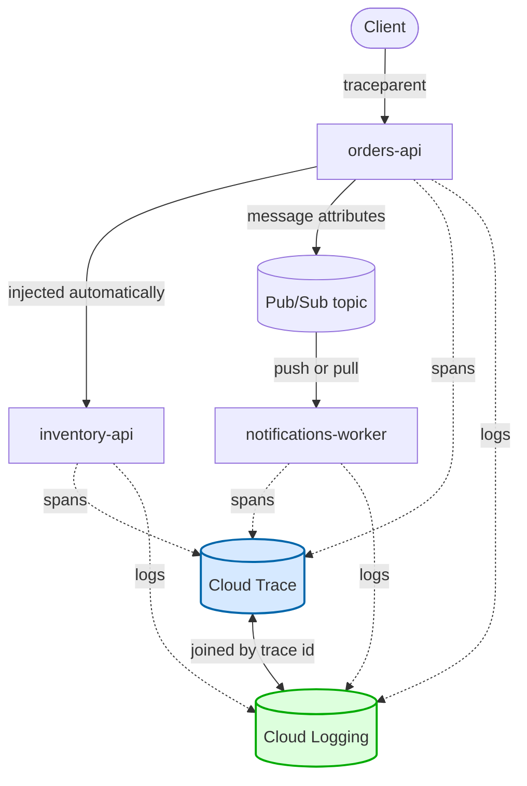

<!-- Each page should have a link to the previous page and (if applicable)the next page. -->

[Previous (Home)](../../README.md)

# Distributed tracing with OpenTelemetry on Google Cloud

> Everything you need to follow a single request across every service it touches — in Cloud Trace as a waterfall, and in Cloud Logging as one filtered list of log lines from every service involved. Python examples, Cloud Run assumed, no vendor APM involved.
>
> The short version: OpenTelemetry generates the trace, Cloud Trace stores it, Cloud Logging joins your log lines to it, and the whole thing hinges on one header being passed along correctly.

## What you get



[Open this chart in mermaid.live →](https://mermaid.live/edit#pako:eNplkjFvwjAQhf_KKV2oRGjVAamoQgI6MiCBxJAwHPEluHXsyD6XRoT_XgdCC8WL7ef3vZPPPkSZERSNIMqV2Wc7tAyraaohjJmSpLmXnOfNI8TxuGGLGVVog9LAJDFWkHUxVnJzhiYnl9QflDEJQM-mRJYZKlU3ME2k_gqosfUdU5JzWBAgs5Vbz-QaWCyT3sJvn5Z-C2wqmT12yGJ5YirvdmAsVF6pBtaJNizzUIyl0S7eG_tJNhC_ZQbgKtQOBvEYZqukN1PGC1i1d7okT_-7zvL6Xr5KVabo9PkldG6KQuriJvbKdpV6o3atX8Fbe78PI3Xo4raGU99BiubK5bhW1HpzqdToQQzpNc_7jq35pNHD8xC7dbyXgnejl-r7hptfuFz8Qfh8B0V9iEqyJUrRfpRDGvGOSkrDJo0E5egVp9GxtbXPvax1Fo7YegqKrwQyvUssLJadfPwBf6fIkg)

Two payoffs, and they're worth separating because they need different work:

1. **A trace waterfall in Cloud Trace.** How long each service took, which call was slow, where the request actually went. This needs an exporter.
2. **Log correlation in Cloud Logging.** Click any log line, choose "show entries for this trace", and see every log line from every service for that one request. This needs a log handler that knows about the current span.

The second one is, in my experience, the one you reach for at 2am.

## The moving parts

| Piece | Job |
|---|---|
| Tracer provider | Creates spans. Owns the service identity. |
| Span exporter | Ships finished spans to Cloud Trace. |
| Sampler | Decides which traces are recorded, so you don't pay for all of them. |
| Propagator | Reads the trace off inbound requests, writes it onto outbound ones. |
| Instrumentation | Opens a span per request, injects context into HTTP clients. |
| Log handler | Stamps the current trace onto every log line. |

Miss any one of them and you get a plausible-looking partial result, which is what makes this fiddly to debug.

## Install

```bash
pip install \
  opentelemetry-sdk \
  opentelemetry-exporter-gcp-trace \
  opentelemetry-resourcedetector-gcp \
  opentelemetry-propagator-gcp \
  opentelemetry-instrumentation-fastapi \
  opentelemetry-instrumentation-httpx \
  opentelemetry-instrumentation-requests \
  google-cloud-logging
```

The `opentelemetry-*` packages release in lockstep and are strict about matching versions, so bump them together or you'll get import errors that look like bugs in your code.

## Step 1: say who you are

Every span carries a resource — the metadata describing the thing that produced it. At minimum give it a service name, because that's what labels the spans in the Cloud Trace UI.

```python
from opentelemetry.resourcedetector.gcp_resource_detector import GoogleCloudResourceDetector
from opentelemetry.sdk.resources import SERVICE_NAME, Resource, get_aggregated_resources

resource = get_aggregated_resources(
    [GoogleCloudResourceDetector()],
    initial_resource=Resource.create({SERVICE_NAME: "orders-api"}),
)
```

The detector queries the metadata server and fills in region, project and revision for you. It's optional — a bare `Resource.create({SERVICE_NAME: ...})` works fine — but the extra attributes are what let you filter traces by revision after a bad deploy.

One caveat: it makes a metadata-server call at startup. Off GCP that call fails and falls through, so it's harmless locally, just slightly slow the first time.

## Step 2: the provider and the exporter

```python
from opentelemetry import trace
from opentelemetry.exporter.cloud_trace import CloudTraceSpanExporter
from opentelemetry.sdk.trace import TracerProvider
from opentelemetry.sdk.trace.export import BatchSpanProcessor

provider = TracerProvider(resource=resource)
provider.add_span_processor(BatchSpanProcessor(CloudTraceSpanExporter()))
trace.set_tracer_provider(provider)
```

`CloudTraceSpanExporter()` takes no arguments in the common case — it picks up Application Default Credentials and the project automatically, which on Cloud Run means it just works. Override the project with the `project_id` argument or the `OTEL_EXPORTER_GCP_TRACE_PROJECT_ID` environment variable if you're exporting somewhere else.

Use `BatchSpanProcessor`, not `SimpleSpanProcessor`. The simple one exports synchronously on every span end, which puts a network round trip in your request path. It exists for debugging.

**You can skip the exporter entirely.** A provider with no span processor still creates spans and still sets them as the current context — which is all the log handler needs. If you only want log correlation and don't care about the waterfall, drop the `add_span_processor` line and you're done: no export, no egress, no Cloud Trace bill.

## Step 3: sampling

By default every trace is recorded and exported. On a service handling real traffic that is a lot of spans.

```python
from opentelemetry.sdk.trace.sampling import ParentBased, TraceIdRatioBased

provider = TracerProvider(
    resource=resource,
    sampler=ParentBased(TraceIdRatioBased(0.1)),   # 10% of traces
)
```

`ParentBased` is the important half. It means: if the incoming request already carries a sampling decision, respect it. Without it, each service samples independently and you get traces with holes in them — service A recorded, service B dropped, the waterfall missing its middle.

The ratio applies only to traces that start at this service. Set it per service, and set it higher on the ones you actually debug.

## Step 4: the propagator

This is the part that makes it *distributed*, and on Google Cloud there are two header formats in play:

- `X-Cloud-Trace-Context` — the legacy Google format. Cloud Run's load balancer adds it to every inbound request.
- `traceparent` — the W3C standard. Everything else uses it.

Handle both:

```python
from opentelemetry.propagate import set_global_textmap
from opentelemetry.propagators.cloud_trace_propagator import CloudTraceFormatPropagator
from opentelemetry.propagators.composite import CompositePropagator
from opentelemetry.trace.propagation.tracecontext import TraceContextTextMapPropagator

set_global_textmap(
    CompositePropagator([CloudTraceFormatPropagator(), TraceContextTextMapPropagator()])
)
```

**Order matters, and it's counterintuitive.** In a composite, the *last* propagator to extract wins. Requests arriving at Cloud Run frequently carry both headers — the load balancer's legacy one and the caller's W3C one. Putting W3C last means you join the caller's actual distributed trace rather than the load balancer's per-hop one.

The same composite injects both formats on the way out, so downstream services get whichever they understand.

## Step 5: instrumentation

```python
from opentelemetry.instrumentation.fastapi import FastAPIInstrumentor
from opentelemetry.instrumentation.httpx import HTTPXClientInstrumentor
from opentelemetry.instrumentation.requests import RequestsInstrumentor

FastAPIInstrumentor.instrument_app(app)   # span per inbound request
HTTPXClientInstrumentor().instrument()    # inject context into outbound calls
RequestsInstrumentor().instrument()
```

Instrument `requests` even if your own code uses something else. Third-party libraries make outbound HTTP calls, and they mostly use `requests`. Instrumenting it means those calls carry your trace without you touching the library.

There are equivalents for SQLAlchemy, psycopg, redis and most things you'd want timing on — same pattern, one `.instrument()` call at startup.

## Step 6: log correlation

Here's the payoff, and it's three lines.

```python
import logging

from google.cloud.logging_v2.handlers import StructuredLogHandler

logging.getLogger().addHandler(StructuredLogHandler(project_id="my-project"))
```

`StructuredLogHandler` reads the currently active OpenTelemetry span itself and stamps the trace fields onto every record. No filter, no adapter, nothing to pass around. A log line comes out as:

```json
{
  "message": "created order 1c4f",
  "severity": "INFO",
  "logging.googleapis.com/trace": "projects/my-project/traces/4bf92f3577b34da6a3ce929d0e0e4736",
  "logging.googleapis.com/spanId": "00f067aa0ba902b7",
  "logging.googleapis.com/trace_sampled": true
}
```

That `trace` field is what powers "show entries for this trace" in Logs Explorer, and what makes the **Logs** tab appear on a trace in Cloud Trace.

Three things worth knowing:

**Put the handler on the root logger.** Then framework logs, library logs and your logs all get the same treatment and the same trace stamp. Attaching it only to your own logger means uvicorn's lines aren't correlated.

**It needs the project id** to build the `projects/<id>/traces/<trace>` resource name. On Cloud Run, read it from `GOOGLE_CLOUD_PROJECT` if set, else the metadata server:

```python
import os

import requests


def resolve_project_id() -> str | None:
    if project_id := os.environ.get("GOOGLE_CLOUD_PROJECT", "").strip():
        return project_id
    try:
        response = requests.get(
            "http://metadata.google.internal/computeMetadata/v1/project/project-id",
            headers={"Metadata-Flavor": "Google"},
            timeout=2,
        )
        response.raise_for_status()
        return response.text.strip() or None
    except requests.RequestException:
        return None
```

**Outside a request, the fields come out empty rather than missing.** Startup logs and background threads have no active span, so you get `"logging.googleapis.com/trace": ""`. That's expected, not a misconfiguration.

## Why app logs need this at all

Worth understanding, because it explains why access logs seem to work "for free" and yours don't.

**Access logs** are written by the platform. Cloud Run sees the inbound request, reads its trace header, writes one entry stamped with that trace. Zero code.

**App logs** cannot be correlated by the platform, ever. A container serves many requests concurrently onto one stdout stream. By the time a line reaches the logging agent it carries no request identity — there is nothing to tie it back. Only your process, holding the request context in memory, can tag each line as it is written.

That's the entire reason step 6 exists.

## Putting it together

A single bootstrap module, called once at startup:

```python
# observability.py
import logging
import os

from google.cloud.logging_v2.handlers import StructuredLogHandler
from opentelemetry import trace
from opentelemetry.exporter.cloud_trace import CloudTraceSpanExporter
from opentelemetry.instrumentation.httpx import HTTPXClientInstrumentor
from opentelemetry.instrumentation.requests import RequestsInstrumentor
from opentelemetry.propagate import set_global_textmap
from opentelemetry.propagators.cloud_trace_propagator import CloudTraceFormatPropagator
from opentelemetry.propagators.composite import CompositePropagator
from opentelemetry.sdk.resources import SERVICE_NAME, Resource
from opentelemetry.sdk.trace import TracerProvider
from opentelemetry.sdk.trace.export import BatchSpanProcessor
from opentelemetry.sdk.trace.sampling import ParentBased, TraceIdRatioBased
from opentelemetry.trace.propagation.tracecontext import TraceContextTextMapPropagator


def configure(service_name: str, *, export: bool = True, sample_ratio: float = 0.1) -> None:
    provider = TracerProvider(
        resource=Resource.create({SERVICE_NAME: service_name}),
        sampler=ParentBased(TraceIdRatioBased(sample_ratio)),
    )
    if export:
        provider.add_span_processor(BatchSpanProcessor(CloudTraceSpanExporter()))
    trace.set_tracer_provider(provider)

    # W3C last: it wins when a request carries both header formats.
    set_global_textmap(
        CompositePropagator([CloudTraceFormatPropagator(), TraceContextTextMapPropagator()])
    )

    HTTPXClientInstrumentor().instrument()
    RequestsInstrumentor().instrument()

    logging.getLogger().addHandler(StructuredLogHandler(project_id=resolve_project_id()))
```

```python
# main.py
import os

import observability

observability.configure("orders-api", export=os.environ.get("K_SERVICE") is not None)

from fastapi import FastAPI                                          # noqa: E402
from opentelemetry.instrumentation.fastapi import FastAPIInstrumentor  # noqa: E402

app = FastAPI()
FastAPIInstrumentor.instrument_app(app)
```

`K_SERVICE` is set by Cloud Run itself, so it's a free "am I deployed?" check with nothing to configure. (Cloud Run *jobs* get `CLOUD_RUN_JOB` instead, not `K_SERVICE` — worth knowing if you share a bootstrap between the two.)

Call `configure()` before importing your framework if you're instrumenting anything that patches at import time. Pure OpenTelemetry instrumentors don't care, but SQLAlchemy engines created before instrumentation won't be traced, so early is a good habit regardless.

## Spans you write yourself

Automatic instrumentation gives you request and client spans. Anything interesting inside a request, you add:

```python
tracer = trace.get_tracer(__name__)


async def process_order(order_id: str) -> None:
    with tracer.start_as_current_span("process order") as span:
        span.set_attribute("order.id", order_id)
        ...
```

Two habits that pay off:

**Name spans for the operation, not the instance.** `"process order"` with an `order.id` attribute, never `f"process order {order_id}"`. High-cardinality span names make the Cloud Trace UI useless — you get thousands of one-off operation names instead of one you can aggregate.

**Record failures on the span**, so they show red in the waterfall:

```python
from opentelemetry.trace import Status, StatusCode

try:
    ...
except Exception as error:
    span.record_exception(error)
    span.set_status(Status(StatusCode.ERROR))
    raise
```

## Crossing Pub/Sub

HTTP works because there's a header. Messaging has message attributes instead, and that's where the context rides.

**Streaming pull** is handled for you. Enable it on both ends — it's off by default — and the client library injects and extracts a `googclient_traceparent` attribute:

```python
from google.cloud import pubsub_v1

publisher = pubsub_v1.PublisherClient(
    publisher_options=pubsub_v1.types.PublisherOptions(enable_open_telemetry_tracing=True)
)
subscriber = pubsub_v1.SubscriberClient(
    subscriber_options=pubsub_v1.types.SubscriberOptions(enable_open_telemetry_tracing=True)
)
```

The subscriber opens its spans with the extracted context current while your callback runs, so your logs get stamped with no further work.

Worth knowing: this is **client-library behaviour, not a service feature**. The Pub/Sub service treats message attributes as opaque data. There's no server-side trace continuity to switch on.

**Push subscriptions need help**, because a push is an ordinary HTTP POST and your framework instrumentation opens a span from *that* request's headers — the delivery, not the publish. The publisher's context is sitting in the JSON body where no HTTP propagator looks.

The tidiest fix is to inject it yourself, under the standard name, and have Pub/Sub promote it to a header:

```python
from opentelemetry.propagate import inject

attributes = {"event_type": "order_created"}
inject(attributes)          # sets attributes["traceparent"]

publisher.publish(topic_path, data, **attributes)
```

```bash
gcloud pubsub subscriptions update order-events-push \
  --push-no-wrapper \
  --push-no-wrapper-write-metadata
```

`--push-no-wrapper-write-metadata` writes message metadata to `x-goog-pubsub-*` headers and message attributes to plain `<key>: <value>` headers. So `traceparent` arrives as a real header, your existing instrumentation continues the trace, and the handler needs no tracing code at all.

If you can't change the subscription, extract from the body instead:

```python
from opentelemetry.propagate import extract


@app.post("/pubsub/order-events")
async def handle(envelope: PushEnvelope) -> dict[str, str]:
    with tracer.start_as_current_span("order-event", context=extract(envelope.message.attributes)):
        logger.info("handling %s", envelope.message.message_id)
    return {"status": "ok"}     # always 2xx, or Pub/Sub redelivers
```

The span you open there is **not** a child of the framework's request span — its parent is the publisher's span, in the publisher's trace. Two spans nested in code, belonging to two different traces. That's correct: a push delivery genuinely is a separate request.

`inject()` and `extract()` need no handle. They read the global propagator you set in step 4, which is also why `inject()` writes nothing at all when tracing isn't configured — the same code is a no-op in tests.

## Local development

Don't export to Cloud Trace from a laptop. Two reasonable modes:

**Off.** Skip `configure()` entirely, or call it with no provider. With no tracer provider set, spans are non-recording, `inject()` writes nothing, and your logs carry no trace. Everything still runs.

**Console.** If you want to see the spans:

```python
from opentelemetry.sdk.trace.export import ConsoleSpanExporter, SimpleSpanProcessor

provider.add_span_processor(SimpleSpanProcessor(ConsoleSpanExporter()))
```

Either way, swap `StructuredLogHandler` for a plain `StreamHandler` locally — single-line JSON is for the logging agent, not for you.

## Actually verifying it

This is the part people skip, and it's where the bugs are. Trace propagation fails silently: each service still logs a trace id, it's just a different one. Every service looks healthy in isolation.

So don't assert that the trace *exists*. Assert that two services' trace ids are **equal**.

The test that catches real bugs: start two services as separate processes, send a request to the first with a known `traceparent`, and check that both services' log output carries that trace id. Separate processes matter — the tracer provider and propagator are global to an interpreter, so two services sharing one would agree about the trace regardless of what crossed the wire.

And keep a negative control: the same pair with `HTTPXClientInstrumentor` disabled, asserting the two trace ids are now *different*. Without it, your correlation test will keep passing on the day someone deletes the injection.

A stubbed HTTP transport isn't enough either. The instrumentation patches the real transport class, so a fake one is never wrapped — the test passes while propagation is broken. Use a real socket.

## Gotchas

- **Don't set the tracer provider twice.** OpenTelemetry refuses the second call and logs a warning you'll never see. If a library also configures one, whoever runs first wins.
- **Watch what else calls `set_global_textmap`.** Some APM agents install their own propagator at import, and if that import happens after your startup code, yours is silently replaced. Check by printing `get_global_textmap()` after your app has been running for a minute, not at startup.
- **Sampling must be `ParentBased`** or your traces get holes in them.
- **Access logs correlate for free, app logs never do.** If only some of your logs show up under a trace, that's the line you're missing.
- **High-cardinality span names** will make Cloud Trace unusable long before they make it slow.
- **Cloud Run jobs** don't get `K_SERVICE`. Check `CLOUD_RUN_JOB` too if you share a bootstrap.

## TL;DR

- Tracer provider + `CloudTraceSpanExporter` in a `BatchSpanProcessor` gets you waterfalls in Cloud Trace.
- `StructuredLogHandler` on the **root** logger gets you log correlation, which is the bit you'll actually use.
- Skip the exporter entirely if you only want log correlation — a provider with no span processor still sets the context.
- Composite propagator with **W3C last**, so you join the caller's trace rather than the load balancer's.
- Instrument `requests` as well as your own client, so third-party libraries propagate too.
- Sample with `ParentBased`, or you'll get traces with holes.
- Pub/Sub: on by default nowhere. Pull is handled by the client library; push needs the context promoted to a header or extracted from the body.
- Test by asserting two services share **the same** trace id, across two real processes, with a negative control.
