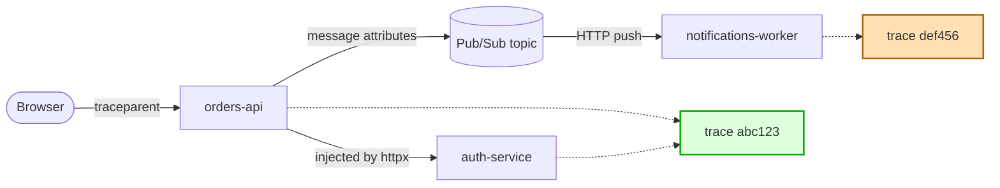

<!-- Each page should have a link to the previous page and (if applicable)the next page. -->

[Previous (Home)](../../README.md)

# Trace correlation across services, and where Pub/Sub push breaks it

> You wire up OpenTelemetry, your logs start carrying a trace id, and for a while everything is wonderful — you click one log line in Logs Explorer, hit "show entries for this trace", and see the whole request walk across three services. Then you add a Pub/Sub push subscription and the chain quietly stops at the topic. Nothing errors. The logs still look fine on their own. They just belong to a different trace now.
>
> This is a writeup of why that happens, what you can do about it, and the one part you can't fix.

## The picture



[Open this chart in mermaid.live →](https://mermaid.live/edit#pako:eNplkU1vwjAMhv9K1F1AohuUjUMPSJt22KQdqhVph5aDm7g0o22qxFlBlP--UAraRw6R_fp9HCc5eFwJ9ELm5aVqeQGa2Nt7WjO3nrRqDepRMgTrMfP9ZUcaODagsaaOPUavidICtfGhkesz6MTeKetP5ISCZXtWEDU757dUJOA23zX8khz_IBUaAxtkQKRlZglNx6I4GUU2u4ttxkg1ko8HKIp75mW1ilhjTdGxD6W3qJNakcwlB5KqNn7bi475cdStv2SrWdLfhUHGZ8H8Mokb7lI_K-emgxYMjMD8_mFxbWpoX6IjWC7LMrwRuZgY0mqL4c0UpkPst1JQEQbN7hcUDFCe4zSbXzlY_Oe8CfMq1BVIcfqzQ-pRgRWmLkk9NxLYklLveLK5R1bxvuauRNqiU2wjgPBZwkZDNcjHb2v4qHA)

`orders-api` and `auth-service` share a trace because the HTTP client injected the context into the outgoing request headers. `notifications-worker` doesn't, because Pub/Sub delivered the message over a brand new HTTP request that knows nothing about the original one.

## Two kinds of log, and only one is free

This distinction is the whole article, so it's worth being precise about it.

**Access logs** are written by the platform. Cloud Run sees the inbound request, reads its `X-Cloud-Trace-Context` header, writes one log entry stamped with that trace. You write no code. If a caller sends a trace, cross-service access-log correlation works out of the box.

**App logs** are the lines your code writes, and the platform cannot correlate them. A container serves many requests concurrently onto one stdout stream. A raw log line arrives with no request identity attached — by the time it reaches the logging agent, there is nothing to tie it to. Only the service itself, holding the request context in-process, can tag each line as it is written.

So the job is: keep something request-scoped alive for the duration of the request, and have the log handler read it.

## Making app logs carry the trace

On Google Cloud that's three pieces.

**A tracer provider with no exporter.** You want a span to exist per request. You do *not* necessarily want to ship it anywhere — if an APM agent is already reporting your transactions, exporting spans as well means double-reporting everything.

```python
from opentelemetry import trace
from opentelemetry.sdk.resources import SERVICE_NAME, Resource
from opentelemetry.sdk.trace import TracerProvider

# No span processor: spans are created and set as the current context, which the
# log handler reads, but never exported anywhere.
trace.set_tracer_provider(TracerProvider(resource=Resource.create({SERVICE_NAME: "orders-api"})))
```

**A propagator that understands both header formats.** Cloud Run's load balancer sends the legacy `X-Cloud-Trace-Context`; everything else sends W3C `traceparent`. A composite handles both, and because the last propagator wins, putting W3C last means a request carrying both joins the caller's distributed trace rather than the load balancer's.

```python
from opentelemetry.propagate import set_global_textmap
from opentelemetry.propagators.cloud_trace_propagator import CloudTraceFormatPropagator
from opentelemetry.propagators.composite import CompositePropagator
from opentelemetry.trace.propagation.tracecontext import TraceContextTextMapPropagator

set_global_textmap(CompositePropagator([CloudTraceFormatPropagator(), TraceContextTextMapPropagator()]))
```

**A log handler that reads the active span.** `google-cloud-logging`'s `StructuredLogHandler` does this itself — no custom filter needed. Put it on the *root* logger so framework and third-party lines get the same treatment.

```python
import logging

from google.cloud.logging_v2.handlers import StructuredLogHandler

logging.getLogger().addHandler(StructuredLogHandler(project_id="my-project"))
```

Then instrument the framework and the HTTP clients:

```python
from opentelemetry.instrumentation.fastapi import FastAPIInstrumentor
from opentelemetry.instrumentation.httpx import HTTPXClientInstrumentor
from opentelemetry.instrumentation.requests import RequestsInstrumentor

FastAPIInstrumentor.instrument_app(app)   # opens the span per request
HTTPXClientInstrumentor().instrument()    # injects it into outgoing calls
RequestsInstrumentor().instrument()       # ditto, for libraries that use requests
```

Instrument `requests` as well as your own HTTP client. Third-party packages make outbound calls too, and they rarely use whichever client you picked. Instrumenting it means those calls chain without you touching the package.

A log line then comes out looking like this, with the trace attached:

```json
{
  "message": "created order 1c4f",
  "severity": "INFO",
  "logging.googleapis.com/trace": "projects/my-project/traces/4bf92f3577b34da6a3ce929d0e0e4736",
  "logging.googleapis.com/spanId": "00f067aa0ba902b7"
}
```

## An aside: the agent that quietly steals your propagator

If you run an APM agent alongside OpenTelemetry — a common setup, since an OTLP-only pipeline often loses the metric timeslices that make APM charts work — there's a failure mode worth knowing about, because it is completely silent.

The New Relic Python agent ships a module, `newrelic.api.opentelemetry`, that calls `set_global_textmap` at module scope, unconditionally, installing its own propagator. The agent imports that module **lazily, when it connects** — which is after your startup code has run. So it replaces the composite propagator you carefully configured, some seconds into the process lifetime.

Two things make this nasty:

1. **With distributed tracing disabled, its propagator injects nothing.** Not a wrong trace — *no* trace. Every outbound call goes out bare and nothing downstream can correlate.
2. **It passes locally.** The agent never fully starts on a developer machine, so it never imports the module, so your propagator survives. It only breaks in a warmed deployment.

The fix is to make the agent's one-time override happen *before* yours, by importing the module yourself during startup. Python caches modules, so the agent's later import never re-executes the top-level code:

```python
from importlib.util import find_spec

if find_spec("newrelic") is not None:
    try:
        import newrelic.api.opentelemetry  # noqa: F401  -- forces its override to run now
    except Exception:
        logger.warning("could not pre-import the agent's otel module; it may override our propagator")

set_global_textmap(CompositePropagator([...]))   # ours goes last, and stays
```

Key it on whether the package is *importable*, not on whether your own config flag says the agent is enabled. A service started through a wrapper script (`newrelic-admin run-program`) needs this just as much, and won't have your flag set.

And log the failure rather than swallowing it. If the pre-import fails, the module isn't cached, the bug is live again, and there is nothing else that will tell you.

## Where it stops: Pub/Sub push

HTTP propagation works because there's a header to put things in. Messaging has no headers — it has message attributes, and that's where the trace has to ride.

The Google Cloud client libraries do support this. Turn it on with `enable_open_telemetry_tracing=True` on the publisher and subscriber options — it's off by default — and the library injects the context into an attribute named `googclient_traceparent`.

Two facts about that mechanism matter a great deal:

**It is client-library behaviour, not a service feature.** Google's own documentation is explicit that the client libraries inject the attribute and the prefix is a client-library convention. The Pub/Sub service treats message attributes as opaque user data. There is no server-side trace continuity waiting to be switched on.

**For streaming pull, that's enough.** The subscriber client extracts the attribute and opens its spans with `start_as_current_span`, so the span is current while your callback runs, so your log handler stamps it. Correlation works with no code from you.

**For push, it isn't.** A push subscription is delivered as an ordinary HTTP POST. Your framework instrumentation opens a span from *that* request's headers — Pub/Sub's delivery trace. The publisher's context is sitting in the JSON body, where no HTTP propagator looks.

## Fixing the app logs

You have two routes, and they differ mostly in how much per-handler code you want.

### Route 1: extract from the body

Read the attribute out of the push envelope and open a span under it:

```python
from opentelemetry.propagate import extract

@router.post("/pubsub/order-events")
async def handle_order_event(envelope: PushEnvelope) -> dict[str, str]:
    # Outside this block we are on Pub/Sub's delivery trace. Inside, on the
    # publisher's. Two different traces — which is correct, because a push
    # delivery really is a separate request.
    with tracer.start_as_current_span("order-event", context=extract(envelope.message.attributes)):
        logger.info("handling %s", envelope.message.message_id)
        ...

    # Always 2xx, or Pub/Sub redelivers.
    return {"status": "ok"}
```

The thing that trips people up here: the inner span is **not** a child of the framework's request span. Its parent is the publisher's span, in the publisher's trace. You end up with two spans nested in code that belong to two unrelated traces, and that's exactly what you want.

If you let the client library write the attribute you'll need to strip the `googclient_` prefix before `extract` recognises the keys. Which leads to the better route.

### Route 2: promote the attribute to a header

Pub/Sub can deliver attributes as HTTP headers. `--push-no-wrapper-write-metadata` writes message metadata to `x-goog-pubsub-*` headers **and message attributes to plain `<key>: <value>` headers**.

So inject the context yourself, under the standard name:

```python
from opentelemetry.propagate import inject

attributes = {"event_type": "order_created"}
inject(attributes)          # sets attributes["traceparent"]

publisher.publish(topic_path, data, **attributes)
```

```bash
gcloud pubsub subscriptions update order-events-push \
  --push-no-wrapper \
  --push-no-wrapper-write-metadata
```

Now `traceparent` arrives as a real HTTP header, your existing framework instrumentation continues the publisher's trace, and the handler needs **no tracing code at all**:

```python
@router.post("/pubsub/order-events")
async def handle_order_event(event: OrderCreated) -> dict[str, str]:
    logger.info("handling %s", event.order_id)   # already on the publisher's trace
    return {"status": "ok"}
```

Three reasons to use the standard `traceparent` name rather than inventing one: `extract` reads it with no translation, framework instrumentation picks it up from the header automatically, and every APM tool already understands it. A bespoke key buys nothing and loses all of that.

`inject()` needs no handle — it reads the global propagator and the active span. That also means it writes **nothing** when tracing isn't configured, so the same code is a no-op in tests and on a developer machine.

The costs: `--push-no-wrapper` changes the request body from the JSON envelope to the raw published message, so your handlers change shape, and `message_id` moves to a header. And you're hand-rolling the injection instead of using the library's flag. For a service with several push endpoints, I think that's clearly worth it — correlation stops being something each handler has to remember to do.

## The access log you can't fix

App logs are solvable. Access logs, as far as I can tell, are not.

Cloud Run stamps the access log from `X-Cloud-Trace-Context`, and that header is not among the ones Pub/Sub writes on a push request. By the time your handler runs and opens a span, the access log has already been written. So "show entries for this trace" gives you a clean chain of app logs with a gap where `POST /pubsub/order-events 200` should be.

There is one route I haven't ruled out. Since `--push-no-wrapper-write-metadata` writes attributes as raw headers under their own names, an attribute literally named `x-cloud-trace-context` ought to arrive as that header:

```python
span = trace.get_current_span().get_span_context()
attributes = {
    "x-cloud-trace-context": f"{trace.format_trace_id(span.trace_id)}/{span.span_id};o=1"
}
publisher.publish(topic_path, data, **attributes)
```

**I have not tested this and would not design around it until someone has.** Two plausible failure modes: Pub/Sub may refuse or strip reserved-looking header names, and the Cloud Run front end may overwrite the header with its own before the access log is written. Neither is documented either way. It's a ten-minute experiment on a dev project — publish with that attribute, hit a push endpoint, check whether the access log carries your trace id.

If you try it, I'd genuinely like to know how it goes.

## Is any of this your fault?

Mostly not. The structural cause is that Google put trace propagation in the **client libraries** while access logs are written by the **service**. The one component that emits the log is the one component that doesn't know about the trace. Two products with first-class Cloud Trace support that don't quite meet in the middle. It's a long-standing complaint — there are open issues about it across several of Google's own client library repos.

The part that isn't anyone's fault: a push delivery genuinely *is* a separate HTTP request, often minutes after the publish. Treating it as the same request is a modelling decision, not an obvious truth — it's why OpenTelemetry's messaging conventions prefer span *links* to parent/child for this. For log correlation you want continuity anyway, but the ambiguity is real, and it's part of why this hasn't been tidied up.

## What travels, and what doesn't

Worth noting what all this is coupled to, if you ever move clouds.

What goes on the wire is standard: W3C `traceparent`. A service running vanilla OpenTelemetry anywhere will continue your trace, and you'll continue theirs. The vendor coupling is entirely in how logs are *formatted locally* — `StructuredLogHandler` and its `logging.googleapis.com/*` fields are GCP-only, and swapping them for a CloudWatch-shaped JSON formatter is a one-function change.

`CloudTraceFormatPropagator` is harmless off GCP. No caller sends `X-Cloud-Trace-Context`, so it never matches, and W3C handles everything.

## TL;DR

- Access logs correlate for free over HTTP; **app logs never do** — a container multiplexes many requests onto one stdout stream, so only your process can tag a line.
- The setup is a tracer provider with no exporter, a composite propagator, a log handler that reads the active span, and instrumentation on the framework plus every HTTP client.
- If an APM agent is also running, check whether it installs its own global propagator on connect. The New Relic one does, silently, after startup.
- Pub/Sub trace propagation is **client-library behaviour**, off by default. It works for streaming pull. For push it doesn't, because the context is in the body and the span is opened from the headers.
- Fix app logs either by extracting from the body, or — better — by injecting into an attribute named `traceparent` and enabling `--push-no-wrapper-write-metadata`, which makes it a header and makes correlation automatic.
- Push access logs can't join the publisher's trace. There may be a header trick; nobody has verified it.
