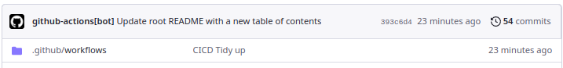

<!-- Each page should have a link to the previous page and (if applicable)the next page. -->
[Previous (Home)](../../README.md)

<!-- Specify the project name, use Pascal Case with spaces. For example, "2M Ham Radio Amplifier". -->
# Markdown Folder to HTML for Blog
A reusable workflow which can create docs-style html folder out of folder.

<!-- Short description of the project and what it is. -->
## Abstract and Introduction
This project, which is available here https://github.com/joakin/markdown-folder-to-html could be used to make a html site for this whole repository. It would be a good way to organize the projects and make them easier to navigate. It would also be a good way to learn how to use the project.

Being a core idea of this potential-projects-repo, it would be a good idea to use this project to create a html site for this repository. It would be a good way to learn how to use the project and also to make the projects easier to navigate.

<!-- Did the project live section start-->
## Did the project live?
This whole website is described in this project. Some parts are currently up like GitHub pipelines but
the whole site is not up yet. Part that is missing is rendering the markdown files into html files.

### Table of Contents
| Section  |
| ---  |
| [Abstract and Introduction](#abstract-and-introduction) | 
| [Related Projects](#related-projects) | 
| [Project Goals](#project-goals) | 
| [Project Requirements](#project-requirements) | 
| [Tags](#tags) | 
| [Main](#main) |
| [Potential CICD Pipelines that could be used](#potential-cicd-pipelines-that-could-be-used) |
| [Issues encountered](#issues-encountered) |
| [Setting up the CICD](#setting-up-the-cicd) |

<!-- List the projects that could be related to this project. For example, if this project is a 2M Ham Radio Amplifier, then the related projects could be a 70cm Ham Radio Amplifier and a 6M Ham Radio Amplifier. -->
### Related Projects

<!-- List the goals of the project. For example, if this project is a 2M Ham Radio Amplifier, then the goals could be to build a 2M Ham Radio Amplifier that is capable of 100W output. -->
### Project Goals
- Create a html site for this repository using markdown-folder-to-html
- Create a script to automatically update the html site when a new project is added
- Host the html site on GitHub Pages or something cheap like S3

<!-- List the requirements of the project. For example, if this project is a 2M Ham Radio Amplifier, then the requirements could be W6PXL pallet, some coax, etc -->
### Project Requirements

<!-- Tags are used to categorize projects. For example, if this project is a 2M Ham Radio Amplifier, then the tags could be "Ham Radio", "Radio Engineering" -->
#### Tags
CICD, GitHub, Markdown, HTML, JavaScript, Node.js
## Main

Markdown to html docs would be useful(even for this page) to create a static HTML content out of folder full or markdown.
It could be used to make simple blogs where users without huge amount of technical knowledge could just learn a bit of github and start writing.
Advantage of a github way would also be ability to leverage all user permissions stuff and data flows that github offer, which could result in a system where articles would need to be approved, spelling checks on pull requests, etc.

### Potential CICD Pipelines that could be used
- Spellcheck on creating pull request
- Creating appropriate folder structure on opening a new issue
- Automatically making a table of contents on the main landing page

### Issues encountered
#### Setting up the CICD 
Took me a while to figure out that you need to specify the permissions for the **GITHUB_SECRET** key which is used to authenticate with your repository.

I kept getting the following error:
```
Run git config user.name github-actions
[main 1fc720e] Update root README with a new table of contents
 1 file changed, 3 insertions(+)
remote: Permission to ivica3730k/potential-project-ideas.git denied to github-actions[bot].
fatal: unable to access 'https://github.com/ivica3730k/potential-project-ideas/': The requested URL returned error: 403
Error: Process completed with exit code 128.
```

It turns out that the solution was to add the following lines on top of the workflow file, granting the **GITHUB_SECRET** key the permission to write to the repository:
``` yaml
permissions:
  contents: write
```
The end result should look like this:
``` yaml
name: Update Table of Contents on Push to Main

permissions:
  contents: write
  
on:
  push:
    branches:
      - main

jobs:
  update-table-of-contents:
    runs-on: ubuntu-latest
    steps:
    - name: Checkout code
      uses: actions/checkout@v3
      with:
        token: ${{ secrets.GITHUB_TOKEN }}

    - name: Run Python Command
      run: python3 migrate_table_of_contents.py

    - name: Set up Git
      run: |
        git config user.name github-actions[bot]
        git config user.email github-actions[bot]@users.noreply.github.com
        git add README.md && git commit -m "Update root README with a new table of contents"
      
    - name: Push changes
      run: | 
        git push origin main

```
Figuring this out took a while and I had to make a lot of commits to the repository to figure out what was wrong.
.